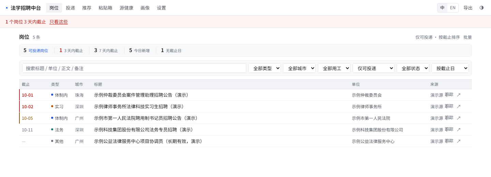

# 法学招聘信息中台

[](https://github.com/1438388098-glitch/legal-job-tracker/actions/workflows/ci.yml)

[English](./README.md) · 简体中文

一个跑在你自己电脑上的 **法学求职信息收集与管理系统**。自动从 33 个官方渠道收集
珠三角 + 韶关的律所 / 体制内 / 法务 / 实习 / 国企岗位（含省属一级与二级公司），
统一去重后在本机网页里筛选浏览、跟踪投递、临期提醒、导出汇总表。去重原则是
"宁可漏合并也不错合并"；简历匹配每一分都有理由、学历设硬门槛；全部数据不出本机。

- 单机运行，数据全在本机 SQLite 文件里，不联网上传任何内容
- 无需 Node / 前端构建链，一个命令启动
- 采集器按"配置 + 选择器"驱动，官网改版时改配置即可，不用动代码

## 界面速览

岗位列表页——首屏统计条（可投递 / 3 天与 7 天内截止 / 今日新增 / 无截止日）、筛选器，以及行首的临期色条与截止日着色：



> 截图使用**自编演示数据**（5 条标题带"演示"的虚构岗位），不含任何真实招聘信息或个人投递记录。

---

## 快速开始

```bash
# 1) 建虚拟环境并装依赖（首次）
py -3.13 -m venv .venv
.venv/Scripts/python.exe -m pip install fastapi "uvicorn[standard]" jinja2 httpx \
    selectolax apscheduler python-multipart openpyxl pytest

# 2) 初始化数据库 + 写入 33 个信息源
.venv/Scripts/python.exe scripts/seed_sources.py

# 3) 首次采集（33 源，慢站有 90 秒预算保护，一般 2~5 分钟）
.venv/Scripts/python.exe -c "import sys;sys.path.insert(0,'.');from app import db;from app.collect.runner import Runner;c=db.connect('data/job.db');db.init_db(c);print(Runner(c).run_all())"

# 4) 启动本地网页
.venv/Scripts/python.exe -m uvicorn app.web.main:create_app --factory --port 8642
```

然后浏览器打开 **http://127.0.0.1:8642** 。

**Windows 日常使用**：直接双击 `start.bat` —— 自动检查环境、起服务、开浏览器。
`start.bat dev` 为调试模式（关闭定时采集）。

> 服务启动后每天 08:05 会自动采集一次（增量，实测约 10 秒）。设环境变量
> `APP_DISABLE_SCHEDULER=1` 可关掉定时任务。

---

## 简历与岗位推荐

`/profile` 上传简历（PDF / Word / 纯文本，**只存在本机数据库**），自动解析出
学历、技能、实习经历类型、意向城市，生成一份**可编辑**的个人画像；
`/recommend` 按匹配度给岗位排序，每一分都有理由：

- 意向城市 ±26 / 岗位类型 ±22 / 技能命中（**标题命中权重 ×2**，上限 26）/
  经历对口 +14 / 学历满足 +8 / 有明确截止日 +6，满分 100 无基线
- **学历硬门槛**：岗位要求硕士而画像本科 → 显著降权且理由明示"学历不足"
- **经验要求匹配**：正文"X 年以上"而画像年限明显不够 → 降权；满足 +6；
  写明欢迎应届且你是应届 +6

解析按小节进行——教育段只取学历（学校/学历/专业**逐行配对**，取最高学历，
避免本科+硕士两段时学校配错行），实习/工作段才取经历与工龄，避免把学制当经验；
意向城市优先读"求职意向"段（实习在东莞不代表想去东莞）；岗位类型也会从意向段
补充推断。已跟踪的、已过期的岗位不会进推荐；平分时优先展示五院四系等高优先级源。

## 公告快照

每条岗位的详情页正文都会**本地留档**（`app/snapshot.py`），官网删稿也能回看。
快照不是裸文本，而是**结构化排版**（`app/web/snapshot_view.py`）：

- **关键信息卡置顶**：截止/报名时间、联系方式、学历要求、待遇等关键行
  先列出来（≤8 行），不用滚屏找
- **正文分级**：公文"一、二、"识别为小节标题，其余按段落排版；
  原始文本折叠保留，结构化视图与原文一键切换
- **安全**：快照来自外网，全部 HTML 转义后输出

---

## 日常怎么用

| 我想做的事 | 去哪里 |
|---|---|
| 看有哪些新岗位 | 首页 `/`，默认**只显示可投递岗位**，按截止日期排序，临期在最上面；点概览条"今日新增"只看今天抓到的 |
| 查一条早就截止的公告 | 顶部筛选切「全部稿件」，或用关键词搜（结果公示类默认不显示但永远搜得到） |
| 只看某类/某城市/某种用工 | 筛选栏（公告性质 / 类型 / 城市 / **用工性质** / 状态 / 关键词）；"编制还是合同制"直接筛 |
| 只看不用赶截止日的 | 概览条"无截止日"，或筛选 `rolling=1`（长期有效/邮箱投递岗，截止列显示绿色"长期"） |
| 临期提醒 | 顶栏横幅：3 天内截止标红、7 天内标黄；**开启了桌面通知的话，每天采集完会弹一条**（含"今天截止 N 条"） |
| 投递跟踪 | 列表行上直接点「跟踪」就进看板（不用进详情页）；或在详情页点「加入投递跟踪」；在 `/board` 推进状态（待投/已投/笔试/面试/Offer/拒） |
| 批量整理 | 列表右上「批量」→ 勾选 → 标为已读 / 归档 |
| 公众号里的招聘信息 | `/paste` 粘贴箱：贴链接 → 系统抓正文提字段 → 你确认入库 |
| 看哪些源挂了 | `/health` 源健康页：每个源的上次成功时间、连续失败次数、最近错误，可单源立即重采 |
| 导出成 Excel | 顶部「导出可投递岗位」/「导出全部稿件」，含用工性质列 |
| 改错字段 | 岗位详情页 →「修改字段」（标题/城市/截止日/类型/备注；**备注会被纳入搜索**） |

**交互上的两个约定**：

- **操作不丢上下文**：从筛选过的列表点进详情、标已读、加跟踪，回来时筛选还在
  （以前所有操作都跳回无筛选的首页）
- **看过即已读**：打开详情页自动标记，不用再点"标记已读"

**搜索会做同义词展开**：搜"律所"同时命中"律师事务所"，搜"聘用制"命中
"劳动合同制书记员"，搜"选调"命中"选调生"——实测把"律所"的召回从 28 条提到 89 条。

**公告性质过滤（重要）**：政务渠道里很大一部分稿件不是"开放报名的岗位"，而是事后
结果公示（拟聘用人员名单公示 / 笔试成绩 / 分数线 / 体检考察）。实测首批 299 条里
这类占 23%，且天然没有投递截止日。系统把稿件分成三类 —— **可投递 / 结果公示 /
其他信息** —— 默认只显示三者的第一类，避免"乱七八糟的信息混杂"。采购询价、听证会
公告、论文征集这类虽然含"招聘/公开"字样但根本不是岗位的稿件，也归到"其他信息"。

**岗位类型与单位名（怎么做到不"一堆未分类"）**：

- 类型判定**三级优先**：源级配置（人社厅栏目整栏都是体制内）→ 标题关键词 →
  兜底归"其他"。早期只靠标题关键词，词表里没有"大学/医院/管委会/辅导员"这类写法，
  导致人社厅栏目 47% 的条目落进"未分类"；现在实测降到 **2.8%（7/252）**
- 单位名**从标题里抽**：政务站列表页根本没有单位字段，但单位名就在标题开头
  （`广东省高级人民法院2026年度选调…`）。`classify.extract_org()` 以机构后缀词为锚点、
  确认右边紧接着正文才采纳，**抽不到就留空**（显示半句话当单位名比空着更糟）。
  可投递条目的单位覆盖率 **98%**
- 校园职位板与中南财接口**都做了收紧**：广外/广大的站内检索是模糊匹配（搜"法务"会
  带出会计专员、销售订单管理），加了一层本地关键词过滤；中南财接口的 `majors` 字段会
  把企业接受的所有专业列全（一条能列 38 个，含法学），拿它当过滤依据会把银行柜员、
  供应链这类泛岗位全捞进来 —— 改为**按岗位名是否含法学角色词**过滤，并把岗位列表
  收窄到法学相关的那几个（`党工团干事,土木工程师,法务专员` → `法务专员`）

**归档规则**：截止日期过后 7 天自动沉底（`status='archived'`），首页不再显示，但搜索
永远能召回。

**去重规则（两层）**：

1. **链接指纹**：同一条 URL 只入库一次，自动忽略 utm 等跟踪参数；
2. **跨源合并**：同一条招聘同时挂在多个渠道时合成一条，卡片标注"N 个来源"，
   详情页列出全部来源链接。合并条件很严 —— 必须**跨源**、标题足够长（≥10 字）、
   标题高度相似、发布时间相差 45 天以内，四个条件同时满足。

   为什么这么严：早期版本只比"标题像不像"，结果把同一批公告的不同期次（中山某镇
   招聘公示 6 期）、不同年份的同名公告（检察院 2023/2024/2025 选调公告）、泛岗位名
   （不同律所的"律师助理"）都合成了同一条，属于实打实的数据损失。现在是宁可漏合并
   （多出一张卡片）也不错合并（吞掉一条真岗位）。

---

## 信息源（33 个，按展示优先级分组）

| 类别 | 源 |
|---|---|
| 法院 / 检察 / 军队 | 广东法院网、广东省检察院、军队人才网（文职招考，法学岗多竞争小） |
| 人社系统（事业单位/国企/公职） | 广东省人社厅、**省人社厅·国企招聘专区（JSON 接口）**、广州、深圳、中山、珠海、佛山、东莞、**韶关×2** 人社局 |
| 公务员 / 选调 | 广东组织工作网·公务员录用（省考+选调公告首发） |
| 国企 | **广东省国资委·百万英才汇南粤专栏**（一个源覆盖几十家一级集团及二级公司）、**越秀集团（大易系统 JSON 接口，聚合越秀系二级公司）**、广东能源集团 |
| 律所 / 律师行业 | 佛山市律协（原"广东律师网"）、广州/深圳/中山/江门/惠州 五地律协 |
| 高校就业网 | 广东外语外贸大学、广州大学、广东金融学院、广州商学院（同平台，站内按法学关键词检索）、**五院四系 5 校**：西南政法（首页增量）、清华、北大、武大（frontpage JSON 适配器，一次逆向两校）、西北政法（跨节点日期归一化） |
| 外校就业中心接口 | 中南财经政法大学就业中心（JSON 接口，按岗位名过滤法学岗） |

**为什么国企靠"聚合专栏 + JSON 接口"而不是逐家官网**：实测抽查 9 家省属一级集团
官网——4 家不可达/反爬、4 家 JS 渲染（北森/大易/自建），静态可抓的只有 2 家；
而政策要求国企招聘信息公开，省国资委"百万英才汇南粤"专栏（178 条【国企招聘】公告）
和省人社厅国企招聘专区（全省实时岗位流，可按"单位性质=国企"+"岗位名关键词"服务端
过滤）两层聚合已覆盖 20+ 一级集团及其二级公司。以后遇到其他用大易（hotjob.cn）的
集团，改一行配置即可复用适配器。

完整清单、验证状态、域名陷阱（哪些旧域名已失效、哪些站点需要 http 降级或 gb2312
转码）见 [`docs/source-registry.md`](docs/source-registry.md)。

各源产出（2026-09-15 抽样快照，共 543 条；已按本地 SQLite 库重算。当时 33 源中
29 源已接入，不在快照内的只有后接入的清华/北大/武大/西北政法 4 校）：

| 源 | 条数 | 说明 |
|---|---|---|
| 广东金融学院·招聘职位 | 51 | 站内法学关键词检索 |
| 省人社厅·国企招聘专区 | 48 | POST JSON 接口，按法务/法律等 6 词服务端过滤 |
| 广东外语外贸大学·招聘职位 | 45 | 站内法学关键词检索 |
| 深圳律协 | 40 | 列表直接带截止日列 |
| 东莞人社 | 30 | 补珠三角缺市 |
| 省国资委·百万英才汇南粤 | 30 | 全部为【国企招聘】公告，零噪音 |
| 广东律师网（佛山律协） | 30 | |
| 省人社厅·事业单位招聘 | 27 | |
| 广东省检察院 | 25 | gb2312 + http 降级（见权衡 3） |
| 佛山人社 | 20 | |
| 深圳人社 | 20 | 走 http（见权衡 2） |
| 珠海人社 | 20 | |
| 江门律协 | 20 | |
| 越秀集团 | 17 | 大易 JSON，positionName 服务端过滤 |
| 中山人社 | 16 | |
| 广州商学院 | 15 | 站内法学关键词检索 |
| 广州人社 | 13 | |
| 韶关人社·人事人才栏 | 12 | 比原通知公告栏更聚焦 |
| 广东法院网 | 11 | |
| 惠州律协 | 10 | |
| 广东组织工作网·公务员录用 | 8 | 经标题关键词过滤后的公告类 |
| 中山律协 | 8 | 日期拆两节点，已做归一化 |
| 广州大学·职位信息 | 7 | 站内法学关键词检索 |
| 广东能源集团 | 6 | 法学相关岗位经关键词过滤 |
| 中南财经政法大学·就业中心 | 6 | JSON 接口，按岗位名过滤出法学岗 |
| 广州律协 | 3 | JSP 片段接口 |
| 军队人才网 | 2 | 年度型更新，文职统考公告是独家信息 |
| 韶关人社·通知公告栏 | 2 | 多为法院送达公告，招聘条目稀疏 |
| 西南政法大学 | 1 | 首页增量块，五院四系单位质量高 |

上表合计 543；类型/公告性质/长期标记等派生字段为同一批 543 条按现行分类规则重算后的值。

类型分布：体制内 244 / 律所 136 / 法务 125 / 实习 28 / 其他 10（1.8%）。
公告性质：可投递 422 / 结果公示 101 / 其他信息 20。
用工性质：编制 81 / 合同制 18；长期有效（邮箱投递）42。

### 加一个新源

绝大多数源不需要写代码，只要在 `scripts/seed_sources.py` 里加一条配置：

```python
dict(slug="xxx", **_html(
    "某某市人社局·招聘公告",
    _idx("https://xxx.gov.cn/zpgg/index.html", 2),   # 列表页（_idx 自动展开分页）
    "ul.list li",              # 条目容器
    title_attr="title",        # 从 title 属性取标题（避免页面上的"…"截断）
    date_sel="span.time",      # 发布日期
    detail_sel="div.article",  # 详情页正文容器（留空则自动挑最像正文的块）
    city="某市", job_type="public")),
```

改完跑这套"校准三件套"：

```bash
.venv/Scripts/python.exe scripts/probe_sources.py          # 从真实页面推断容器选择器候选
.venv/Scripts/python.exe scripts/peek.py <slug> <正则>      # 打印原始 HTML 片段对照
.venv/Scripts/python.exe scripts/preview_parse.py <slug>    # 预览解析结果对不对
.venv/Scripts/python.exe -m pytest tests/test_sources.py -q # fixture 回归
```

配置字段的完整说明在 `app/collect/generic_html.py` 顶部注释里。常用字段：
`list_urls`（多入口/分页）、`link_sel`、`title_sel`、`title_attr`、`date_sel`、`org_sel`、
`detail_sel`、`no_detail`、`url_scheme`、`keep_keywords`、`title_keywords`、
`exclude_url`、`max_age_days`、`detail_budget`、`notice_kind`、`encoding`、`verify`。

### 改了判定规则怎么办

`notice_kind` / 截止日期这类派生字段可以**用本地快照重算，不必重新联网抓取**：

```bash
.venv/Scripts/python.exe scripts/reclassify.py              # 全量重算
.venv/Scripts/python.exe scripts/reclassify.py --kind-only  # 只重算公告性质（最快）
.venv/Scripts/python.exe scripts/reclassify.py --refresh-org  # 连单位名也重新抽
```

单位名默认是**粘性**的：列表页明确给出的单位名比从标题猜的更可靠，所以已有值不会被覆盖；
只有带 `--refresh-org` 时才会用新规则重新抽一遍（抽不到则保留原值）。

<details>
<summary><strong>界面设计细节</strong>（字体 / 主题 / 动效 / 版式规则）</summary>

定位是**单机高频使用的工具**，所以版面按"密度优先"设计，不做装饰：

- **首屏概览数字**：可投递总数 / 3 天内截止 / 7 天内截止 / 今日新增，进页面就知道今天
  该看什么（3 天内截止标红）
- **列表按列对齐扫读**：截止 / 类型 / 城市 / 标题 / 单位 / 来源，每行 34px，
  一屏（1000px 高）能看到约 28 个岗位；行首 2px 细条标紧急度（红=3 天内、黄=7 天内），
  比文字标签省空间；类型用一个 6px 圆点区分（律所紫 / 体制内蓝 / 法务青 / 实习琥珀），
  比整块彩色标签省宽度又保留扫读线索
- **明暗双主题**：顶栏右侧的三态按钮循环切换 **跟随系统 → 浅色 → 深色**，
  选择记在 localStorage。首帧由 `<head>` 内联脚本写死主题，**不会闪白/闪黑**；
  两套色板都按小字 4.5:1 对比度校验过（`scripts/contrast_check.py` 可自查）
- **动效克制且有意义**：列表行 160ms 错峰上浮（只前 12 行，总时长约 300ms）、
  行悬停时左侧色条展开、按钮按下位移、卡片悬停微抬、切换主题时全页颜色 220ms 过渡。
  大区块（筛选栏、概览条、正文、看板）**刻意不做淡入** —— 它们是页面主体，
  一旦渲染慢就会"整页发灰看不见"，得不偿失。全部动效在
  `prefers-reduced-motion` 下自动关闭
- **设计规范成文**（第 7 轮收敛为 Linear/Notion 式极简工具风，规则写在
  `style.css` 注释里，每条可查）：控件高度只允许两档（28px 标准 / 24px 行内）；
  **数字永远中性色**，彩色只留给需要行动的语义（3 天内=红、7 天内=黄）；
  行内按钮默认中性灰、hover 才点亮；筛选栏面板化，与概览条/列表三层分区
- **窄屏（<880px）**列表折叠成两行式，信息不删减；下拉框**即选即筛**（无"筛选"按钮），
  搜索框回车提交

字体用**思源黑体（Noto Sans SC）**，并且是**本地托管**的：`scripts/localize_font.py`
按 unicode-range 只下载页面实际用得到的字片（约 72 片 / 2MB），所以断网也能正常显示，
且不依赖任何字体 CDN。

改了文案或加了新岗位、想补齐字体覆盖时重跑一次即可：

```bash
.venv/Scripts/python.exe scripts/localize_font.py     # 重新计算字集并补齐缺失字片
```

样式与脚本在 `app/web/static/`（`style.css` + `app.js` + `i18n.js`），改完刷新页面即生效
（链接带 mtime 版本号，不会被浏览器缓存卡住）。改完视觉想实际看一眼：

```bash
.venv/Scripts/python.exe scripts/dev_shots.py --theme light --out D:/shots \
    "list=/" 1400x1000 "detail=/jobs/1" 1280x700
.venv/Scripts/python.exe scripts/dev_shots.py --theme dark --out D:/shots "list=/"
```

</details>

---

## 目录结构

```
app/
  db.py            SQLite schema、FTS 全文索引、自动归档、老库补列迁移
  dedup.py         URL 指纹 + 跨源合并规则
  dateparse.py     中文日期解析 + 截止日期锚定抽取
  classify.py      岗位类型 / 城市 / 公告性质 / 单位名抽取（extract_org）
  snapshot.py      详情页正文快照（本地留档，官网删稿也能回看）
  collect/
    http.py        带重试与连接池的抓取（4xx 与硬 TLS 失败不重试）
    generic_html.py 配置驱动的通用列表适配器
    zuel.py        中南财经政法大学 JSON 接口适配器（按岗位名过滤法学岗）
    pastebox.py    粘贴箱（贴链接抓正文）
    store.py       入库与跨源合并
    runner.py      采集调度、源级配置注入、源健康记录、可选 Windows 通知
  web/
    main.py        应用入口 + 每日定时任务 + Jinja 过滤器
    routes.py      全部路由（列表/详情/看板/粘贴箱/健康/设置/导出）+ 首屏概览数字
    snapshot_view.py 快照结构化排版（关键信息卡/小节标题/HTML 转义）
    static/        style.css（明暗双主题 + 设计规范 + 动效）、app.js（主题切换）、i18n.js（界面语言）、本地字体
    templates/     Jinja2 模板
scripts/
  seed_sources.py      信息源配置（**加源改这里**）
  sync_fixtures.py     录制真实页面为测试 fixture
  probe_sources.py / peek.py / preview_parse.py   选择器校准三件套
  reclassify.py        用本地快照重算派生字段
  localize_font.py     按页面字符集下载思源黑体字片（本地托管）
  contrast_check.py    校验两套主题的配色对比度（WCAG AA）
  dev_shots.py         批量截图核对视觉（可强制浅色/深色）
  png_probe.py / png_crop.py  不装 Pillow 也能采样/裁剪截图，判断配色是否真的生效
tests/                 192 项测试，含 32/33 个源的真实 fixture 回归（ggfw_gq 待补录）
docs/
  source-registry.md                     全网源清单与域名陷阱
  iterations.md                          迭代记录（7 轮，每轮调研/执行/验证全程）
  superpowers/specs/...-design.md        设计文档
  superpowers/plans/...-legal-job-tracker.md  实施计划与验收记录
```

---

## 性能与稳定性

- 首次全量采集：**约 2~5 分钟**（33 源，并发 6 抓详情，每源 90 秒详情预算兜底）
- 日常增量采集：**约 10 秒**（已知 URL 跳过详情抓取，只处理新条目）
- **采集时机**：每天 08:05 与 20:05 各一轮（晚上那轮是为了当天下午发布的公告
  不用等到第二天）；**服务不是天天开着也不怕**——启动时发现今天还没采过就立即补一轮
- 慢站保护：每个源有 90 秒（慢站 60 秒）的详情抓取预算，超预算后剩余条目只保留
  标题/日期，正文留空 —— 避免深圳人社这类慢站把整轮采集从 1 分钟拖到 10 分钟以上
- 失败隔离：单个源失败只记录到 `/health`，不影响其他源；开了桌面通知的话，
  采集完会连"几个源失败"一起报

## 已知取舍

1. **选择器漂移**：官网改版会让某个源解析不到内容 —— `tests/test_sources.py` 用真实
   fixture 做回归，`/health` 显示源健康状况。33 个源中 32 个各有 2026-09 录制的页面
   （ggfw_gq 待补录），改版后这里会率先失败，提示你重新校准。
2. **深圳人社走 http**：该站 https 在本机 OpenSSL 3 下握手失败（BAD_ECPOINT），
   配置里用 `url_scheme: "http"` 强制降级。
3. **省检察院需 gb2312**：配置 `encoding: "gb2312"` + http 降级。
4. **JS 渲染站点**（深圳/广州中院、东莞律协、南方电网等）本期不做，覆盖靠上级聚合源
   （广东法院网 / 省人社厅）和粘贴箱弥补。
5. **广外/广大职位板**详情页是 JS 渲染，拿不到"专业要求"字段，改用站内 `?keyword=`
   检索法学相关岗位；由于站内检索是模糊匹配，再叠一层本地关键词过滤。
6. **韶关岗位稀疏**：韶关人社栏目以法院送达公告为主，每页约 2 条招聘稿件；
   韶关的岗位主要靠广东省人社厅集中招聘公告覆盖。
7. **中南财接口只保留法学岗**：该接口 `majors` 字段会把企业接受的所有专业列全，
   不能用它筛法学；改为按岗位名是否含法学角色词过滤。代价是"面向法学专业但岗位名
   泛化"（如"管理培训生"）的记录会被丢掉 —— 换来的是列表里不再混进银行柜员、
   供应链这类噪音。
8. **截止日期不硬凑**：只在"截止/报名时间/投递"等词所在句子里取日期，取不到就留空。
   早期版本取全篇最大日期，把体检时间、考试时间甚至"年龄截止至报名开始当天"当成
   投递截止（213 条里 70 条明显错）。现在 79 条里只有 3 条可疑 —— **错误的截止日比
   没有截止日更糟**，会造成假的红色临期提醒。
9. **单位名抽不到就留空**：`extract_org` 只在能确认"机构后缀 + 紧接着正文"时才采纳，
   所以像"关于2025年度劳动合同制书记员招聘笔试安排的公告"这类标题里根本没写单位的，
   单位列为空。可投递条目的单位覆盖率 98%，剩下 2% 确实没有可抽的信息。
10. **"今日新增"首日会很大**：首次采集那天会把当天入库的全部算进来，第二天起回落。
11. **合并只发生在入库时**：跨源合并修好前已经各自入库的重复条目不会自动合并
    （自动合并历史数据风险高）。新抓到的重复岗位会正常合并；老数据里看着重复的，
    可以手动归档一条。

---

## 测试

```bash
.venv/Scripts/python.exe -m pytest tests/ -q     # 192 passed
.venv/Scripts/python.exe scripts/contrast_check.py   # 明暗两套配色对比度自检
```

- 单元测试：去重（含 3 类误合并回归 + 短标题带单位的合并）、日期解析（含截止年份
  锚定）、分类（含单位名抽取、用工性质、长期有效、源级配置注入的回归）、入库、
  HTTP 重试策略、简历解析与匹配打分、快照结构化（关键信息卡/小节标题/HTML 转义）、
  网页路由与筛选（含同义词、批量操作、返回保留筛选、自动已读）、导出
- fixture 回归：33 个源中 32 个有真实录制的页面（ggfw_gq 待补录），验证选择器仍能解析出条目
- fixture 录制时间：2026-09（测试内用固定基准日，不会随真实日期推移失效）

---

## 开源说明

- **License**：MIT（见 [LICENSE](LICENSE)）
- 简历、画像、岗位库、投递记录**只存在本机** `data/`（已 gitignore），代码本身
  不含任何用户数据；`tests/fixtures/` 是从公开官网录制的页面片段
- 欢迎提 Issue / PR：接入新源（改 `scripts/seed_sources.py` 配置即可）、修
  适配器、补城市。PR 前跑 `pytest tests/ -q` 保持全绿
